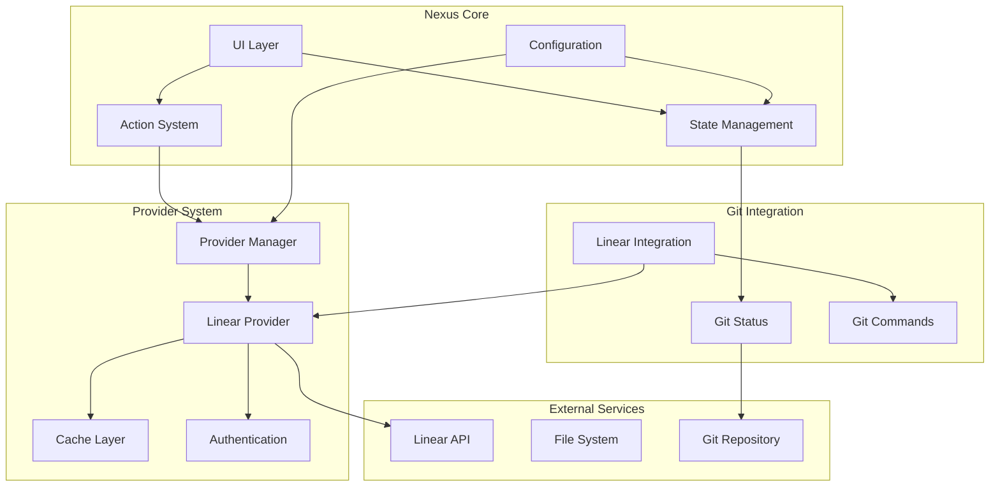
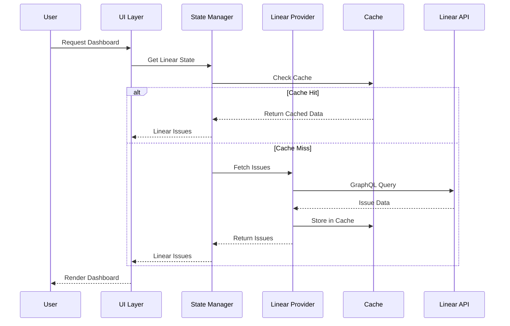

# Nexus.nvim Linear Integration - Technical Specifications

## Architecture Overview

### System Architecture



### Data Flow Architecture



## Provider System Specifications

### Provider Interface

```lua
---@class Provider
---@field name string Provider identifier
---@field config table Provider-specific configuration
local Provider = {}

---Initialize provider with configuration
---@param config table Provider configuration
---@return Provider instance
function Provider:new(config) end

---Authenticate with the service
---@return boolean success, string? error
function Provider:authenticate() end

---Fetch issues based on criteria
---@param opts? table Query options
---@return table[]? issues, string? error
function Provider:get_issues(opts) end

---Update an issue
---@param id string Issue identifier
---@param updates table Fields to update
---@return boolean success, string? error
function Provider:update_issue(id, updates) end

---Create a new issue
---@param data table Issue creation data
---@return table? issue, string? error
function Provider:create_issue(data) end

---Get current user information
---@return table? user, string? error
function Provider:get_user_info() end

---Perform health check
---@return table health_status
function Provider:health_check() end

---Clean up resources
function Provider:cleanup() end
```

### Linear Provider Specifications

#### GraphQL Client

```lua
---@class LinearClient
---@field config LinearConfig
---@field base_url string
---@field timeout number
local LinearClient = {}

-- Configuration
LinearClient.base_url = "https://api.linear.app/graphql"
LinearClient.timeout = 10000 -- 10 seconds
LinearClient.max_retries = 3
LinearClient.retry_delay = 1000 -- 1 second
```

#### Data Models

```lua
---@class LinearIssue
---@field id string Unique issue ID
---@field identifier string Issue identifier (e.g., "LIN-123")
---@field title string Issue title
---@field description? string Issue description
---@field url string Issue URL in Linear
---@field priority number Priority level (0-4)
---@field estimate? number Story point estimate
---@field createdAt string ISO timestamp
---@field updatedAt string ISO timestamp
---@field assignee? LinearUser Assigned user
---@field state LinearState Current state
---@field team LinearTeam Team information
---@field labels LinearLabel[] Issue labels
---@field cycle? LinearCycle Current cycle
---@field project? LinearProject Associated project

---@class LinearUser
---@field id string User ID
---@field name string Display name
---@field email string Email address
---@field avatarUrl? string Avatar image URL

---@class LinearState
---@field id string State ID
---@field name string State name
---@field type string State type (backlog, unstarted, started, completed, canceled)
---@field color string Hex color code
---@field position number Sort position

---@class LinearTeam
---@field id string Team ID
---@field name string Team name
---@field key string Team key (e.g., "LIN")
---@field description? string Team description

---@class LinearLabel
---@field id string Label ID
---@field name string Label name
---@field color string Hex color code

---@class LinearCycle
---@field id string Cycle ID
---@field name string Cycle name
---@field number number Cycle number
---@field startsAt? number Start timestamp
---@field endsAt? number End timestamp

---@class LinearProject
---@field id string Project ID
---@field name string Project name
---@field description? string Project description
```

## Caching System Specifications

### Cache Architecture

```lua
---@class CacheManager
---@field storage table Storage backend
---@field default_ttl number Default TTL in seconds
local CacheManager = {}

-- Cache levels
CacheManager.MEMORY = 1    -- In-memory cache (fastest)
CacheManager.DISK = 2      -- Persistent disk cache
CacheManager.NETWORK = 3   -- Network/API source

-- Cache strategies
CacheManager.WRITE_THROUGH = "write_through"
CacheManager.WRITE_BACK = "write_back"
CacheManager.WRITE_AROUND = "write_around"
```

### Cache Key Strategy

```
Format: "provider:resource:parameters:hash"
Examples:
- "linear:issues:assigned:team123:a1b2c3"
- "linear:issue:LIN-123:full"
- "linear:user_info:current:7d8e9f"
- "linear:teams:all:g4h5i6"
```

### Cache TTL Configuration

| Resource Type | TTL | Rationale |
|---------------|-----|-----------|
| Issues (list) | 300s (5min) | Issues change frequently during active work |
| Issue (single) | 180s (3min) | Individual issues may update often |
| User info | 3600s (1hr) | User information rarely changes |
| Teams | 7200s (2hr) | Team structure is relatively stable |
| Workflow states | 7200s (2hr) | Workflow configuration changes infrequently |
| Cycles | 1800s (30min) | Cycle information updates regularly |

## Performance Specifications

### Latency Requirements

| Operation | Target | Maximum | Notes |
|-----------|--------|---------|-------|
| Dashboard load (cached) | < 50ms | < 100ms | Cached data rendering |
| Dashboard load (fresh) | < 500ms | < 2000ms | Fresh API data |
| Issue action (cached) | < 100ms | < 200ms | State updates, etc. |
| Issue action (API) | < 1000ms | < 3000ms | Create, update operations |
| Git integration | < 10ms | < 50ms | Branch/commit analysis |

### Memory Usage

| Component | Target | Maximum | Notes |
|-----------|--------|---------|-------|
| Base plugin | < 2MB | < 5MB | Core functionality |
| Linear provider | < 3MB | < 8MB | Including cached data |
| Total with Linear | < 8MB | < 15MB | Complete integration |

### API Rate Limiting

```lua
---@class RateLimiter
---@field requests_per_minute number
---@field burst_capacity number
---@field current_usage number
local RateLimiter = {}

-- Linear API limits
RateLimiter.requests_per_minute = 300  -- Linear's rate limit
RateLimiter.burst_capacity = 10        -- Allow bursts
RateLimiter.backoff_multiplier = 2     -- Exponential backoff
```

## State Management Specifications

### State Structure

```lua
---@class NexusState
local state = {
  -- Core state
  initialized = false,
  current_buffer = nil,
  window_config = {},
  
  -- Git state
  git = {
    is_repo = false,
    files = {},
    commits = {},
    current_branch = nil,
    status_cache_time = 0,
  },
  
  -- Provider state
  providers = {
    linear = {
      enabled = false,
      authenticated = false,
      loading = false,
      error = nil,
      issues = {},
      user_info = {},
      teams = {},
      current_cycle = {},
      last_updated = 0,
    }
  },
  
  -- UI state
  ui = {
    section_ranges = {},
    selected_item = nil,
    window_width = 0,
    scroll_position = 0,
  }
}
```

### State Update Patterns

```lua
-- Observer pattern for reactive updates
local observers = {
  git_status_changed = {},
  linear_issues_updated = {},
  ui_selection_changed = {},
}

-- State update with notifications
function state.update(path, value)
  local old_value = state.get(path)
  state.set(path, value)
  
  -- Notify observers
  local event_name = path:gsub("%.", "_") .. "_changed"
  if observers[event_name] then
    for _, callback in ipairs(observers[event_name]) do
      callback(value, old_value)
    end
  end
end
```

## Error Handling Specifications

### Error Classification

```lua
---@class ErrorType
local ErrorType = {
  -- Network errors
  NETWORK_TIMEOUT = "network_timeout",
  NETWORK_UNAVAILABLE = "network_unavailable",
  API_RATE_LIMITED = "api_rate_limited",
  
  -- Authentication errors  
  AUTH_INVALID_KEY = "auth_invalid_key",
  AUTH_EXPIRED = "auth_expired",
  AUTH_INSUFFICIENT_SCOPE = "auth_insufficient_scope",
  
  -- Data errors
  DATA_INVALID_RESPONSE = "data_invalid_response",
  DATA_NOT_FOUND = "data_not_found",
  DATA_VALIDATION_FAILED = "data_validation_failed",
  
  -- System errors
  SYSTEM_OUT_OF_MEMORY = "system_out_of_memory",
  SYSTEM_IO_ERROR = "system_io_error",
  SYSTEM_UNKNOWN = "system_unknown",
}
```

### Error Recovery Strategies

| Error Type | Recovery Strategy | User Impact |
|------------|------------------|-------------|
| Network timeout | Retry with exponential backoff | Show cached data, indicate stale |
| Rate limited | Queue requests, respect limits | Temporary slowdown, notify user |
| Invalid auth | Prompt for re-authentication | Request API key update |
| Data not found | Graceful degradation | Hide missing sections |
| System error | Log error, continue operation | Non-blocking notification |

### Error Response Format

```lua
---@class ErrorResponse
---@field code string Error code from ErrorType
---@field message string Human-readable message
---@field context table Additional error context
---@field timestamp number Error occurrence time
---@field recoverable boolean Whether error can be retried
---@field user_action? string Suggested user action
```

## Security Specifications

### API Key Management

```lua
---@class ApiKeyManager
local ApiKeyManager = {}

-- Security requirements
ApiKeyManager.MIN_KEY_LENGTH = 32
ApiKeyManager.KEY_PATTERN = "^lin_api_[a-zA-Z0-9]{40,}$"
ApiKeyManager.STORAGE_ENCRYPTED = true
ApiKeyManager.MEMORY_CLEAR_ON_EXIT = true
```

### Security Best Practices

1. **API Key Storage**
   - Store in environment variables when possible
   - Encrypt stored keys using Neovim's crypto functions
   - Clear API keys from memory on plugin exit
   - Never log API keys in debug output

2. **Network Security**
   - Always use HTTPS for API requests
   - Validate SSL certificates
   - Implement request signing for sensitive operations
   - Use secure headers (User-Agent, etc.)

3. **Data Privacy**
   - Cache only non-sensitive data
   - Respect user privacy preferences
   - Implement data retention policies
   - Allow cache clearing on demand

## Integration Specifications

### Git Integration

#### Branch Name Patterns

```lua
-- Supported patterns for issue extraction
local BRANCH_PATTERNS = {
  "^feat/([A-Z]+%-[0-9]+)%-(.*)$",    -- feat/LIN-123-description
  "^fix/([A-Z]+%-[0-9]+)%-(.*)$",     -- fix/LIN-123-bugfix
  "^([A-Z]+%-[0-9]+)%-(.*)$",         -- LIN-123-feature
  "^([A-Z]+%-[0-9]+)$",               -- LIN-123
  "/([A-Z]+%-[0-9]+)%-",              -- any/path/LIN-123-desc
}
```

#### Commit Message Enhancement

```lua
-- Commit message patterns
local COMMIT_PATTERNS = {
  has_issue_id = "%f[%w]([A-Z]+%-[0-9]+)%f[%W]",
  completion_keywords = {
    "fix", "fixes", "fixed",
    "close", "closes", "closed",
    "resolve", "resolves", "resolved",
    "complete", "completes", "completed"
  }
}
```

### UI Integration

#### Keyboard Shortcuts

| Key | Action | Context |
|-----|--------|---------|
| `<Enter>` | Open issue in browser | Issue line |
| `i` | Mark as "In Progress" | Issue line |
| `d` | Mark as "Done" | Issue line |
| `b` | Create branch from issue | Issue line |
| `c` | Create commit with issue | Issue line |
| `r` | Refresh Linear data | Anywhere |
| `n` | Create new issue | Linear section |
| `<Tab>` | Navigate to next issue | Issue navigation |
| `<S-Tab>` | Navigate to previous issue | Issue navigation |

#### Display Format

```
 Linear Issues (Sprint 42: 3 days left)
 ● [IN-PROGRESS] LIN-123: Fix authentication flow (High) [2h]
 ○ [TODO] LIN-124: Add user preferences endpoint (Med) [4h] 
 ◐ [IN-REVIEW] LIN-125: Update documentation (Low) [1h]
 ◷ [BLOCKED] LIN-126: Refactor database layer (High)
```

## Testing Specifications

### Test Categories

1. **Unit Tests**
   - Provider methods
   - Data parsing functions
   - Cache operations
   - State management

2. **Integration Tests**
   - End-to-end workflows
   - Git-Linear integration
   - UI rendering and interactions
   - Error scenarios

3. **Performance Tests**
   - Load testing with large datasets
   - Memory usage monitoring
   - Startup time measurement
   - API response time validation

### Mock Framework

```lua
---@class MockLinearAPI
local MockLinearAPI = {}

-- Mock responses
MockLinearAPI.responses = {
  viewer = { id = "user123", name = "Test User" },
  issues = { nodes = {...} },
  teams = { nodes = {...} },
}

-- Mock network conditions
MockLinearAPI.network_conditions = {
  normal = { delay = 100, success_rate = 1.0 },
  slow = { delay = 2000, success_rate = 1.0 },
  unreliable = { delay = 500, success_rate = 0.7 },
  offline = { delay = 0, success_rate = 0.0 },
}
```

## Deployment Specifications

### Configuration Validation

```lua
---@class ConfigValidator
local ConfigValidator = {}

-- Validation rules
ConfigValidator.rules = {
  api_key = {
    required = true,
    type = "string",
    min_length = 32,
    pattern = "^lin_api_"
  },
  max_issues = {
    type = "number",
    min = 1,
    max = 100,
    default = 10
  },
  auto_refresh = {
    type = "number", 
    min = 0,
    default = 300
  }
}
```

### Health Check Implementation

```lua
---@class HealthCheck
local HealthCheck = {}

function HealthCheck.run()
  local checks = {}
  
  -- API connectivity
  table.insert(checks, {
    name = "Linear API",
    status = test_api_connection(),
    message = "API reachable and responding"
  })
  
  -- Authentication
  table.insert(checks, {
    name = "Authentication", 
    status = test_authentication(),
    message = "API key valid and authorized"
  })
  
  -- Cache system
  table.insert(checks, {
    name = "Cache System",
    status = test_cache_operations(),
    message = "Cache read/write operations functional"
  })
  
  return checks
end
```

This technical specification provides the detailed implementation requirements for building robust, performant, and secure Linear integration with Nexus.nvim, following established patterns and best practices.